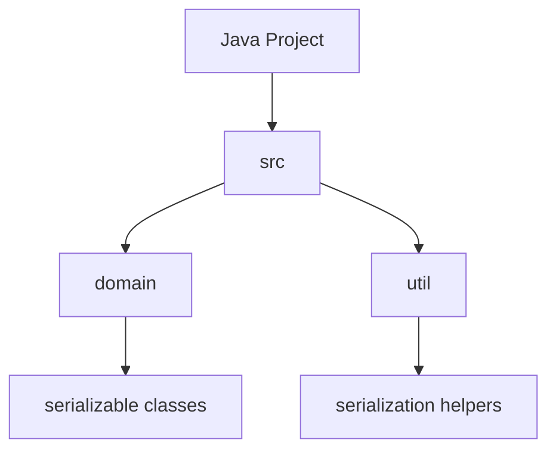
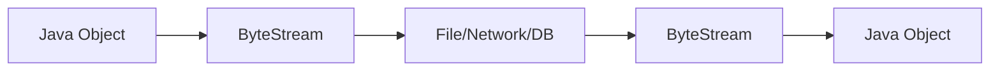
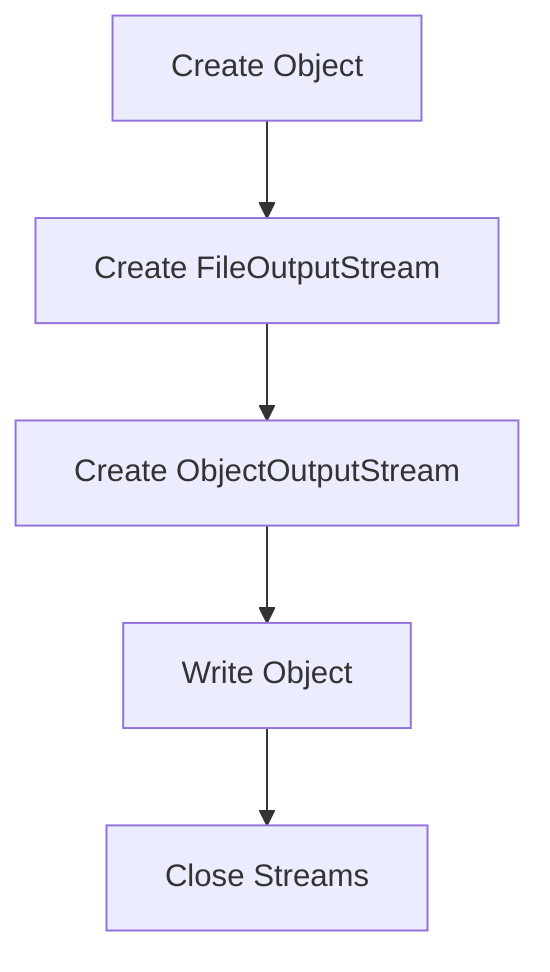
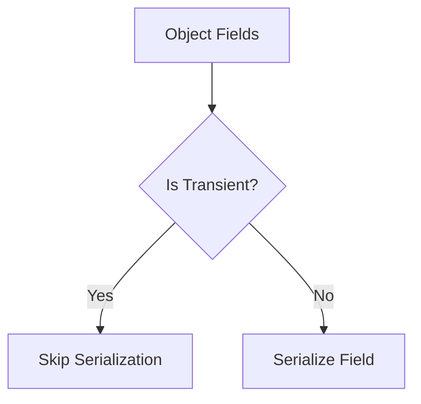
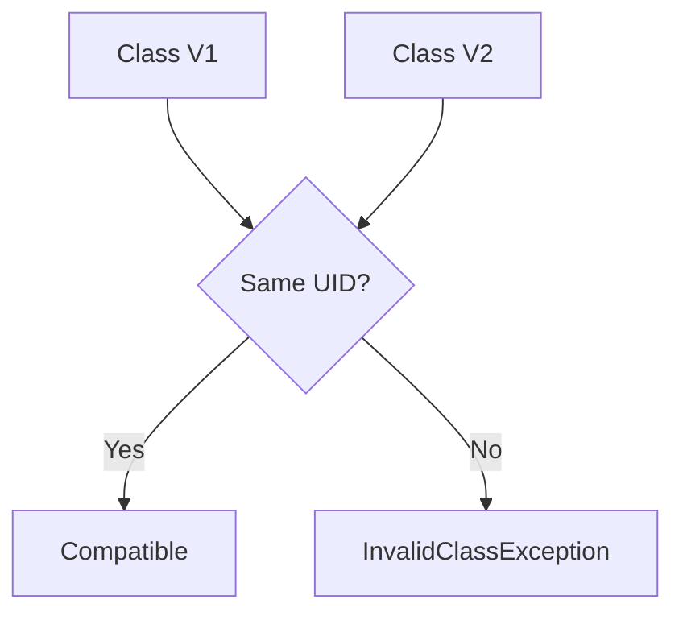

# Java Serialization Lab

## Table of Contents

1. [Project Setup](#project-setup)
2. [Introduction to Serialization](#introduction-to-serialization)
3. [Basic Serialization Operations](#basic-serialization-operations)
4. [Working with Transient Fields](#working-with-transient-fields)
5. [SerialVersionUID](#serialversionuid)
6. [Best Practices and Common Pitfalls](#best-practices-and-common-pitfalls)

## Project Setup

### Concept Introduction: Java Project Structure

In Java development, organizing your code for serialization requires proper project structure. A typical serialization project includes:

- Classes that implement `Serializable`
- Input/Output stream handling
- Resource management with try-with-resources



### DIY Task 1: Create Project Structure

1. Create a new Java project named `SerializationLab`
2. Create a package named `com.example.serialization`
3. Create the following classes:
   - `Person.java` (will implement Serializable)
   - `SerializationDemo.java` (will contain main method)

## Introduction to Serialization

### Concept Introduction: Serialization Flow

Serialization converts Java objects into a byte stream, while deserialization reverses this process.



### Code Example: Basic Person Class

```java
package com.example.serialization;

import java.io.Serializable;

public class Person implements Serializable {
    private String name;
    private int age;
    
    public Person(String name, int age) {
        this.name = name;
        this.age = age;
    }
    
    @Override
    public String toString() {
        return "Person{name='" + name + "', age=" + age + "}";
    }
}
```

### DIY Task 2: Implement Serialization

1. Create a Person object
2. Serialize it to a file
3. Deserialize it back to an object
4. Print the object before and after

Expected output:
<details>
<summary>Click to reveal</summary>

```
Original Person: Person{name='Alice', age=25}
After Serialization and Deserialization: Person{name='Alice', age=25}
```
</details>

## Basic Serialization Operations

### Concept Introduction: Serialization Process



### Code Example: Complete Serialization

```java
import java.io.*;

public class SerializationDemo {
    public static void main(String[] args) {
        Person person = new Person("Alice", 25);
        
        // Serialization
        try (FileOutputStream fileOut = new FileOutputStream("person.ser");
             ObjectOutputStream out = new ObjectOutputStream(fileOut)) {
            out.writeObject(person);
            System.out.println("Person serialized");
        } catch (IOException e) {
            e.printStackTrace();
        }
        
        // Deserialization
        try (FileInputStream fileIn = new FileInputStream("person.ser");
             ObjectInputStream in = new ObjectInputStream(fileIn)) {
            Person deserializedPerson = (Person) in.readObject();
            System.out.println("Person deserialized");
            System.out.println(deserializedPerson);
        } catch (IOException | ClassNotFoundException e) {
            e.printStackTrace();
        }
    }
}
```

Expected output:
<details>
<summary>Click to reveal</summary>

```
Person serialized
Person deserialized
Person{name='Alice', age=25}
```
</details>

### DIY Task 3: Multiple Objects

1. Create an ArrayList of Person objects
2. Serialize the entire list
3. Deserialize and print each person

## Working with Transient Fields

### Concept Introduction: Transient Fields

The `transient` keyword marks fields that shouldn't be serialized.



### Code Example: Transient Fields

```java
public class Employee implements Serializable {
    private String name;
    private transient String password;
    private transient int salary;
    
    public Employee(String name, String password, int salary) {
        this.name = name;
        this.password = password;
        this.salary = salary;
    }
    
    @Override
    public String toString() {
        return "Employee{name='" + name + "', password='" + password + 
               "', salary=" + salary + "}";
    }
}
```

### DIY Task 4: Implement Transient Fields

1. Create an Employee object with sensitive data
2. Serialize and deserialize it
3. Observe the transient fields

Expected output:
<details>
<summary>Click to reveal</summary>

```
Original Employee: Employee{name='Bob', password='secret123', salary=50000}
Deserialized Employee: Employee{name='Bob', password='null', salary=0}
```
</details>

## SerialVersionUID

### Concept Introduction: Version Control



### Code Example: SerialVersionUID

```java
public class Student implements Serializable {
    private static final long serialVersionUID = 1L;
    
    private String name;
    private int grade;
    // New field added in V2
    private String course;
    
    public Student(String name, int grade) {
        this.name = name;
        this.grade = grade;
    }
}
```

### DIY Task 5: Version Management

1. Create and serialize a Student object
2. Add a new field to Student class
3. Try to deserialize the old object
4. Handle version compatibility

## Best Practices and Common Pitfalls

### Common Issues

1. Not implementing Serializable
2. Forgetting to handle exceptions
3. Not closing streams properly
4. Ignoring SerialVersionUID

### Code Example: Best Practices

```java
public class BestPracticesDemo implements Serializable {
    private static final long serialVersionUID = 1L;
    
    private final String id;
    private transient Logger logger;
    
    public BestPracticesDemo(String id) {
        this.id = id;
        this.logger = Logger.getLogger(this.getClass().getName());
    }
    
    private void writeObject(ObjectOutputStream out) throws IOException {
        out.defaultWriteObject();
    }
    
    private void readObject(ObjectInputStream in) 
            throws IOException, ClassNotFoundException {
        in.defaultReadObject();
        this.logger = Logger.getLogger(this.getClass().getName());
    }
}
```

### DIY Task 6: Final Project

Create a complete serialization system that:
1. Handles multiple object types
2. Uses transient fields appropriately
3. Implements custom serialization methods
4. Includes proper error handling
5. Follows all best practices

---

Remember to handle resources properly and always use try-with-resources when dealing with I/O streams. Happy coding!
