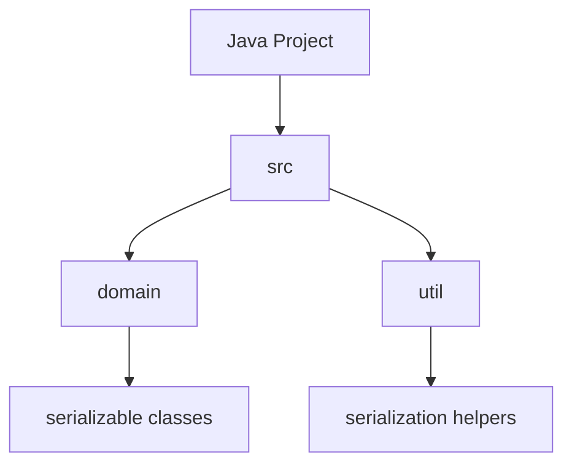
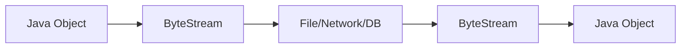
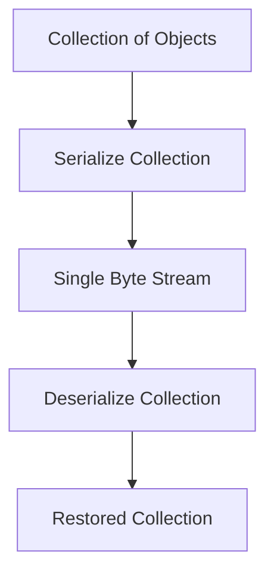
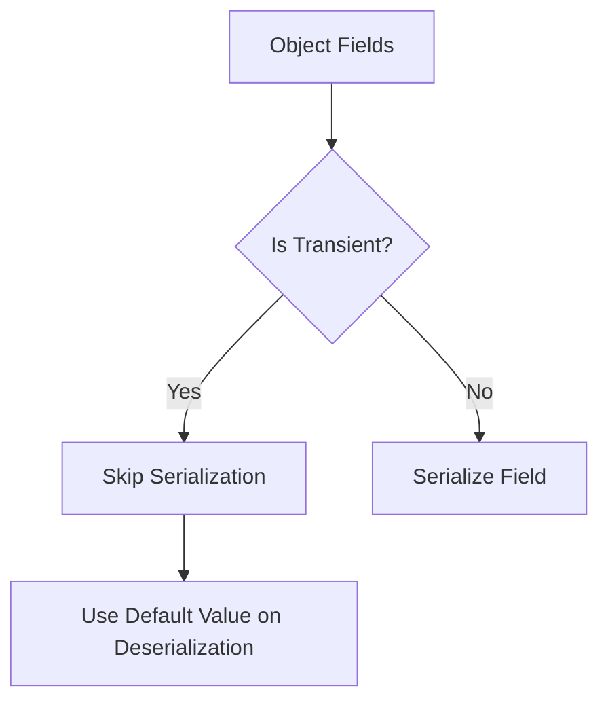
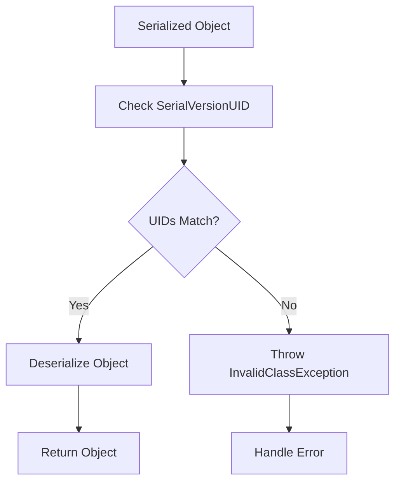
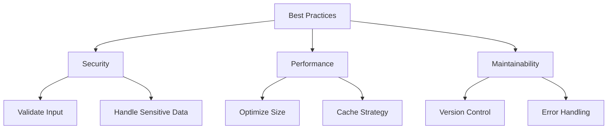

# Java Serialization Lab

## Table of Contents

1. [Project Setup](#1-project-setup)
2. [Introduction to Serialization](#2-introduction-to-serialization)
3. [Basic Serialization Operations](#3-basic-serialization-operations)
4. [Working with Transient Fields](#4-working-with-transient-fields)
5. [SerialVersionUID](#5-serialversionuid)
6. [Best Practices and Common Pitfalls](#6-best-practices-and-common-pitfalls)

## 1. Project Setup

### 1.1 Concept Introduction: Java Project Structure

In Java development, organizing your code for serialization requires proper project structure. A typical serialization project includes several key components that work together to enable object serialization and deserialization. The structure helps maintain clean separation of concerns and makes the code more maintainable.

Understanding this structure is crucial because serialization involves multiple moving parts - from the classes being serialized to the utility classes that handle the serialization process. A well-organized project structure makes it easier to manage these components and troubleshoot issues when they arise.

Additionally, following standard project structure conventions makes it easier for other developers to understand and work with your code, as they'll know where to find different components of the system.

The project structure also helps manage resources efficiently, particularly when dealing with serialized files and their storage locations.



### 1.2 DIY Task 1: Create Project Structure

1. Create a package named `ie.atu.serialization`
2. Create a Main class with the following starter code:

```java
package ie.atu.serialization;

public class Main {
    public static void main(String[] args) {
        // Create your CoffeeShop object here
        System.out.println("Hello, Java Serialization!");
    }
}
```

5. Run this code to make sure everything is working as expected.

<details>
<summary>Click to reveal expected output</summary>

```
Hello, Java Serialization!
```
</details>

## 2. Introduction to Serialization

### 2.1 Concept Introduction: Serialization Flow

Serialization is a crucial mechanism in Java that enables you to convert objects into a format that can be easily stored or transmitted. This process is fundamental to many Java applications, particularly those that need to persist data or communicate over networks.

When an object is serialized, not only is the object itself converted, but all objects referenced by that object are also serialized. This creates a complete snapshot of the object's state that can be reconstructed later.

Understanding the flow of serialization is essential because it helps you anticipate how your objects will be handled and what considerations you need to make when designing serializable classes. This knowledge is particularly important when dealing with complex object graphs or when performance is a concern.

The process works bidirectionally, allowing you to convert objects to bytes (serialization) and bytes back to objects (deserialization).



### 2.2 Code Example: Book Management System

```java
// File: Book.java
package ie.atu.serialization.demo;

import java.io.Serializable;

public class Book implements Serializable {
    private String title;
    private String author;
    private double price;
    
    public Book(String title, String author, double price) {
        this.title = title;
        this.author = author;
        this.price = price;
    }
    
    @Override
    public String toString() {
        return "Book{title='" + title + "', author='" + 
               author + "', price=" + price + "}";
    }
}
```
```java
// File: Main.java
package ie.atu.serialization.demo;

import java.io.*;

public class Main {
    public static void main(String[] args) {
        // Create a book
        Book book = new Book("Java Fundamentals", "John Doe", 29.99);
        System.out.println("Original Book: " + book);
        
        // Serialize
        try (FileOutputStream fileOut = new FileOutputStream("resources/book.ser");
             ObjectOutputStream out = new ObjectOutputStream(fileOut)) {
            out.writeObject(book);
            System.out.println("Book has been serialized");
        } catch (IOException e) {
            e.printStackTrace();
        }
        
        // Deserialize
        try (FileInputStream fileIn = new FileInputStream("resources/book.ser");
             ObjectInputStream in = new ObjectInputStream(fileIn)) {
            Book deserializedBook = (Book) in.readObject();
            System.out.println("Book has been deserialized");
            System.out.println("Deserialized Book: " + deserializedBook);
        } catch (IOException | ClassNotFoundException e) {
            e.printStackTrace();
        }
    }
}
```

<details>
<summary>Click to see expected output</summary>

```
Original Book: Book{title='Java Fundamentals', author='John Doe', price=29.99}
Book has been serialized
Book has been deserialized
Deserialized Book: Book{title='Java Fundamentals', author='John Doe', price=29.99}
```
</details>

### 2.3 DIY Task 2: Implement Movie Serialization

Now create your own serialization system for movies:

1. Create a Movie class that implements Serializable with these fields:
   - title (String)
   - director (String)
   - year (int)
   - rating (double)

2. In the Main method:
   - Creates a movie object
   - Serializes it to "resources/movie.ser"
   - Deserializes it back
   - Prints the object before and after serialization

3. Add validation to ensure the year is between 1900 and current year

4. Handle potential exceptions appropriately

<details>
<summary>Click to see expected output</summary>

```
Original Movie: Movie{title='The Matrix', director='Wachowskis', year=1999, rating=8.7}
Movie has been serialized
Movie has been deserialized
Deserialized Movie: Movie{title='The Matrix', director='Wachowskis', year=1999, rating=8.7}
```
</details>

## 3. Basic Serialization Operations

### 3.1 Concept Introduction: Collection Serialization

When working with real applications, you'll often need to serialize collections of objects rather than single instances. This introduces additional complexity as you need to manage multiple objects and their relationships.

Java's serialization mechanism handles collections seamlessly, preserving not only the objects but also the collection structure itself. This means that when you deserialize a List or Set, you get back the same type of collection with all its elements.

Understanding collection serialization is crucial for building scalable applications, as it allows you to persist and transmit groups of related objects efficiently. It's particularly useful for batch processing and data synchronization scenarios.



### 3.2 Code Example: List Serialization

```java
// File: Main.java
package ie.atu.serialization.demo;

import java.io.*;
import java.util.ArrayList;
import java.util.List;

public class Main {
    public static void main(String[] args) {
        List<Book> books = new ArrayList<>();
        books.add(new Book("The Hobbit", "J.R.R. Tolkien", 19.99));
        books.add(new Book("1984", "George Orwell", 15.99));
        books.add(new Book("Pride and Prejudice", "Jane Austen", 12.99));
        
        System.out.println("Original catalog:");
        books.forEach(System.out::println);
        
        // Serialize list
        serializeBooks(books, "resources/library.ser");
        
        // Deserialize list
        List<Book> loadedBooks = deserializeBooks("resources/library.ser");
        
        System.out.println("\nDeserialized catalog:");
        loadedBooks.forEach(System.out::println);
    }
    
    private static void serializeBooks(List<Book> books, String filename) {
        try (ObjectOutputStream out = new ObjectOutputStream(
                new FileOutputStream(filename))) {
            out.writeObject(books);
            System.out.println("\nCatalog has been serialized");
        } catch (IOException e) {
            e.printStackTrace();
        }
    }
    
    private static List<Book> deserializeBooks(String filename) {
        List<Book> books = new ArrayList<>();
        try (ObjectInputStream in = new ObjectInputStream(
                new FileInputStream(filename))) {
            books = (List<Book>) in.readObject();
            System.out.println("Catalog has been deserialized");
        } catch (IOException | ClassNotFoundException e) {
            e.printStackTrace();
        }
        return books;
    }
}
```

<details>
<summary>Click to see expected output</summary>

```
Original catalog:
Book{title='The Hobbit', author='J.R.R. Tolkien', price=19.99}
Book{title='1984', author='George Orwell', price=15.99}
Book{title='Pride and Prejudice', author='Jane Austen', price=12.99}

Catalog has been serialized
Catalog has been deserialized

Deserialized catalog:
Book{title='The Hobbit', author='J.R.R. Tolkien', price=19.99}
Book{title='1984', author='George Orwell', price=15.99}
Book{title='Pride and Prejudice', author='Jane Austen', price=12.99}
```
</details>

### 3.3 DIY Task 3: Implement Movie Catalog

Create a movie catalog system that can serialize and deserialize a list of movies:

1. In the main method:
   - Add movies to a catalog
   - Save the catalog to a file
   - Load the catalog from a file
   - Display all movies

2. Add methods to:
   - Search movies by director
   - Filter movies by year range
   - Sort movies by rating

3. Test with at least 5 different movies

<details>
<summary>Click to see expected output</summary>

```
Original Movie Catalog:
Movie{title='The Matrix', director='Wachowskis', year=1999, rating=8.7}
Movie{title='Inception', director='Christopher Nolan', year=2010, rating=8.8}
Movie{title='The Dark Knight', director='Christopher Nolan', year=2008, rating=9.0}
Movie{title='Pulp Fiction', director='Quentin Tarantino', year=1994, rating=8.9}
Movie{title='Interstellar', director='Christopher Nolan', year=2014, rating=8.6}

Catalog has been serialized
Catalog has been deserialized

Movies by Christopher Nolan:
Movie{title='Inception', director='Christopher Nolan', year=2010, rating=8.8}
Movie{title='The Dark Knight', director='Christopher Nolan', year=2008, rating=9.0}
Movie{title='Interstellar', director='Christopher Nolan', year=2014, rating=8.6}

Movies between 2000-2010:
Movie{title='Inception', director='Christopher Nolan', year=2010, rating=8.8}
Movie{title='The Dark Knight', director='Christopher Nolan', year=2008, rating=9.0}

Movies sorted by rating:
Movie{title='The Dark Knight', director='Christopher Nolan', year=2008, rating=9.0}
Movie{title='Pulp Fiction', director='Quentin Tarantino', year=1994, rating=8.9}
Movie{title='Inception', director='Christopher Nolan', year=2010, rating=8.8}
Movie{title='The Matrix', director='Wachowskis', year=1999, rating=8.7}
Movie{title='Interstellar', director='Christopher Nolan', year=2014, rating=8.6}
```
</details>

## 4. Working with Transient Fields

### 4.1 Concept Introduction: Transient Data

The transient keyword in Java provides a way to exclude specific fields from the serialization process. This is particularly useful when dealing with sensitive data or temporary state that shouldn't be persisted.

Understanding when and how to use transient fields is crucial for maintaining security and data integrity in your applications. Common use cases include passwords, cached data, and derived values that can be recalculated.

Fields marked as transient will be initialized to their default values (null for objects, 0 for numbers, false for booleans) when the object is deserialized. This behavior needs to be considered when designing your classes.



### 4.2 Code Example: User Profile

```java
// File: UserProfile.java
package ie.atu.serialization.demo;

import java.io.*;

public class UserProfile implements Serializable {
    private String username;
    private transient String password;
    private transient int loginAttempts;
    private String email;
    
    public UserProfile(String username, String password, String email) {
        this.username = username;
        this.password = password;
        this.email = email;
        this.loginAttempts = 0;
    }
    
    @Override
    public String toString() {
        return String.format("UserProfile{username='%s', password='%s', " +
                           "loginAttempts=%d, email='%s'}", 
                           username, password, loginAttempts, email);
    }
}

// File: UserProfileSerializer.java
package ie.atu.serialization.demo;

import java.io.*;

public class UserProfileSerializer {
    public static void main(String[] args) {
        UserProfile user = new UserProfile("johndoe", "secret123", "john@example.com");
        System.out.println("Original User: " + user);
        
        // Serialize
        try (ObjectOutputStream out = new ObjectOutputStream(
                new FileOutputStream("resources/user.ser"))) {
            out.writeObject(user);
            System.out.println("User has been serialized");
        } catch (IOException e) {
            e.printStackTrace();
        }
        
        // Deserialize
        try (ObjectInputStream in = new ObjectInputStream(
                new FileInputStream("resources/user.ser"))) {
            UserProfile deserializedUser = (UserProfile) in.readObject();
            System.out.println("User has been deserialized");
            System.out.println("Deserialized User: " + deserializedUser);
        } catch (IOException | ClassNotFoundException e) {
            e.printStackTrace();
        }
    }
}
```

<details>
<summary>Click to see expected output</summary>

```
Original User: UserProfile{username='johndoe', password='secret123', loginAttempts=0, email='john@example.com'}
User has been serialized
User has been deserialized
Deserialized User: UserProfile{username='johndoe', password='null', loginAttempts=0, email='john@example.com'}
```
</details>

### 4.3 DIY Task 4: Bank Account

Create a bank account system that properly handles sensitive data:

1. Create a BankAccount class with:
   - accountNumber (String)
   - accountHolder (String)
   - balance (double)
   - transient pin (String)
   - transient lastAccessTime (Date)

2. Implement methods to:
   - Deposit money
   - Withdraw money (requires PIN)
   - Check balance
   - Update PIN

3. Test serialization and deserialization, ensuring sensitive data is properly handled

<details>
<summary>Click to see expected output</summary>

```
Original Account: BankAccount{accountNumber='1234567890', accountHolder='Jane Doe', balance=1000.0, pin='9876', lastAccessTime='2024-03-18 10:30:45'}
Account has been serialized

Account has been deserialized
Deserialized Account: BankAccount{accountNumber='1234567890', accountHolder='Jane Doe', balance=1000.0, pin='null', lastAccessTime='null'}

Attempting to withdraw with null PIN: Access denied
Setting new PIN: Success
Balance check after PIN update: 1000.0
Withdrawal of 500.0: Success
Final balance: 500.0
```
</details>

## 5. SerialVersionUID

### 5.1 Concept Introduction: Version Control in Serialization

The SerialVersionUID is a crucial component in Java's serialization mechanism that helps maintain compatibility between different versions of your serializable classes. It acts as a version number that helps Java determine if a serialized object is compatible with the current class definition.

When an object is deserialized, Java compares the SerialVersionUID of the serialized object with that of the class in the current runtime. If they don't match, an InvalidClassException is thrown. This mechanism helps prevent data corruption that could occur from trying to deserialize incompatible objects.

Managing SerialVersionUID is particularly important in enterprise applications where serialized objects might persist for long periods or be transmitted between different versions of an application. Proper versioning helps ensure smooth application updates and data migration.



### 5.2 Code Example: Product Catalog Version Control

```java
// File: Product.java - Version 1
package ie.atu.serialization.demo;

import java.io.Serializable;

public class Product implements Serializable {
    private static final long serialVersionUID = 1L;
    
    private String name;
    private double price;
    
    public Product(String name, double price) {
        this.name = name;
        this.price = price;
    }
    
    @Override
    public String toString() {
        return "Product{name='" + name + "', price=" + price + "}";
    }
}

// File: ProductCatalog.java
package ie.atu.serialization.demo;

import java.io.*;
import java.util.ArrayList;
import java.util.List;

public class ProductCatalog {
    public static void main(String[] args) {
        // Version 1: Create and serialize products
        List<Product> products = new ArrayList<>();
        products.add(new Product("Laptop", 999.99));
        products.add(new Product("Mouse", 29.99));
        
        System.out.println("Original Products (Version 1):");
        products.forEach(System.out::println);
        
        // Serialize version 1
        serializeProducts(products, "resources/products_v1.ser");
        
        // Simulate code update by using Product class version 2
        System.out.println("\nAttempting to deserialize with Version 2 class...");
        deserializeProducts("resources/products_v1.ser");
    }
    
    private static void serializeProducts(List<Product> products, String filename) {
        try (ObjectOutputStream out = new ObjectOutputStream(
                new FileOutputStream(filename))) {
            out.writeObject(products);
            System.out.println("\nProducts have been serialized");
        } catch (IOException e) {
            e.printStackTrace();
        }
    }
    
    private static void deserializeProducts(String filename) {
        try (ObjectInputStream in = new ObjectInputStream(
                new FileInputStream(filename))) {
            List<Product> loadedProducts = (List<Product>) in.readObject();
            System.out.println("Products have been deserialized");
            loadedProducts.forEach(System.out::println);
        } catch (IOException | ClassNotFoundException e) {
            e.printStackTrace();
        }
    }
}

// File: Product.java - Version 2 (with new field)
public class Product implements Serializable {
    private static final long serialVersionUID = 2L; // Changed version
    
    private String name;
    private double price;
    private String category; // New field
    
    public Product(String name, double price) {
        this(name, price, "Uncategorized");
    }
    
    public Product(String name, double price, String category) {
        this.name = name;
        this.price = price;
        this.category = category;
    }
    
    @Override
    public String toString() {
        return "Product{name='" + name + "', price=" + price + 
               ", category='" + category + "'}";
    }
}
```

<details>
<summary>Click to see expected output</summary>

```
Original Products (Version 1):
Product{name='Laptop', price=999.99}
Product{name='Mouse', price=29.99}

Products have been serialized

Attempting to deserialize with Version 2 class...
java.io.InvalidClassException: ie.atu.serialization.demo.Product; local class incompatible: 
stream classdesc serialVersionUID = 1, local class serialVersionUID = 2
```
</details>

### 5.3 DIY Task 5: Game Save System

Create a game save system that handles version compatibility:

1. Create a GameSave class (Version 1) with:
   - playerName (String)
   - score (int)
   - level (int)
   - serialVersionUID = 1L

2. Create a save/load system

3. Update GameSave to Version 2 by adding:
   - playTime (long)
   - achievements (List<String>)
   - serialVersionUID = 2L

4. Implement a compatibility layer that can:
   - Load old saves
   - Convert them to the new format
   - Save in the new format

<details>
<summary>Click to see expected output</summary>

```
Creating Version 1 save:
GameSave{playerName='Player1', score=1000, level=5}
Save file created successfully

Updating to Version 2...
Loading old save with compatibility layer...
Converting to new format...
GameSave{playerName='Player1', score=1000, level=5, playTime=0, achievements=[]}

Creating new Version 2 save:
GameSave{playerName='Player2', score=2000, level=8, playTime=3600, achievements=[Boss1, Boss2]}
New save file created successfully

Loading both saves:
Version 1 (converted): GameSave{playerName='Player1', score=1000, level=5, playTime=0, achievements=[]}
Version 2 (native): GameSave{playerName='Player2', score=2000, level=8, playTime=3600, achievements=[Boss1, Boss2]}
```
</details>

## 6. Best Practices and Common Pitfalls

### 6.1 Concept Introduction: Serialization Best Practices

Implementing serialization effectively requires following certain best practices and being aware of common pitfalls. Proper implementation ensures both data integrity and application maintainability.

Security considerations are particularly important when dealing with serialized data, as improperly handled serialization can lead to vulnerabilities. Understanding these risks and how to mitigate them is crucial for building secure applications.

Performance implications should also be considered, as serialization can be resource-intensive. Knowing when and how to optimize serialization can significantly impact your application's performance.



### 6.2 Code Example: Robust Serialization Implementation

```java
// File: SerializationDemo.java
package ie.atu.serialization.demo;

import java.io.*;
import java.util.logging.Logger;

public class SecureProduct implements Serializable {
    private static final long serialVersionUID = 1L;
    private static final Logger logger = Logger.getLogger(SecureProduct.class.getName());
    
    private String name;
    private double price;
    private transient String secretKey;
    
    // Constructor with validation
    public SecureProduct(String name, double price) {
        validateInput(name, price);
        this.name = name;
        this.price = price;
        this.secretKey = generateKey();
    }
    
    private void validateInput(String name, double price) {
        if (name == null || name.trim().isEmpty()) {
            throw new IllegalArgumentException("Name cannot be null or empty");
        }
        if (price < 0) {
            throw new IllegalArgumentException("Price cannot be negative");
        }
    }
    
    private String generateKey() {
        return java.util.UUID.randomUUID().toString();
    }
    
    // Custom serialization handling
    private void writeObject(ObjectOutputStream out) throws IOException {
        logger.info("Serializing product: " + name);
        out.defaultWriteObject();
    }
    
    private void readObject(ObjectInputStream in) 
            throws IOException, ClassNotFoundException {
        logger.info("Deserializing product");
        in.defaultReadObject();
        this.secretKey = generateKey(); // Regenerate transient data
        validateInput(name, price); // Revalidate after deserialization
    }
    
    @Override
    public String toString() {
        return "SecureProduct{name='" + name + "', price=" + price + 
               ", secretKey='" + secretKey + "'}";
    }
}

// Usage demonstration
public class BestPracticesDemo {
    public static void main(String[] args) {
        try {
            // Create product with validation
            SecureProduct product = new SecureProduct("Laptop", 999.99);
            System.out.println("Original product: " + product);
            
            // Serialize with proper resource management
            File file = new File("resources/secure_product.ser");
            file.getParentFile().mkdirs(); // Ensure directory exists
            
            try (ObjectOutputStream out = new ObjectOutputStream(
                    new FileOutputStream(file))) {
                out.writeObject(product);
                System.out.println("Product serialized securely");
            }
            
            // Deserialize with validation
            try (ObjectInputStream in = new ObjectInputStream(
                    new FileInputStream(file))) {
                SecureProduct loadedProduct = (SecureProduct) in.readObject();
                System.out.println("Deserialized product: " + loadedProduct);
            }
            
            // Demonstrate validation
            try {
                new SecureProduct(null, 100); // Should throw exception
            } catch (IllegalArgumentException e) {
                System.out.println("Validation caught invalid input: " + 
                                 e.getMessage());
            }
            
        } catch (Exception e) {
            System.err.println("Error occurred: " + e.getMessage());
            e.printStackTrace();
        }
    }
}
```

<details>
<summary>Click to see expected output</summary>

```
Original product: SecureProduct{name='Laptop', price=999.99, secretKey='123e4567-e89b-12d3-a456-426614174000'}
Product serialized securely
Deserialized product: SecureProduct{name='Laptop', price=999.99, secretKey='789a0123-b45c-67d8-e90f-123456789000'}
Validation caught invalid input: Name cannot be null or empty
```
</details>

### 6.3 DIY Task 6: Secure Banking System

Create a secure banking system that implements all best practices:

1. Create classes for:
   - BankAccount (implements Serializable)
   - Transaction (implements Serializable)
   - SecurityManager (handles validation and encryption)

2. Implement:
   - Proper input validation
   - Secure handling of sensitive data
   - Custom serialization methods
   - Comprehensive error handling
   - Logging
   - Version control

3. Create a test suite that verifies:
   - Data integrity after serialization
   - Proper handling of invalid input
   - Security of sensitive data
   - Version compatibility
   - Resource cleanup

<details>
<summary>Click to see expected output</summary>

```
Creating new account...
BankAccount{id='AC001', holder='John Doe', balance=1000.0}
Account validated and secured

Performing transactions...
Transaction{id='T001', type='DEPOSIT', amount=500.0} - Success
Transaction{id='T002', type='WITHDRAWAL', amount=200.0} - Success
Current balance: 1300.0

Serializing account state...
Account state secured and saved

Deserializing account...
Account loaded successfully
Validation passed
Security checks passed
BankAccount{id='AC001', holder='John Doe', balance=1300.0}

Testing security...
Attempt to create invalid account - Caught: Account holder name cannot be empty
Attempt to withdraw negative amount - Caught: Amount must be positive
Attempt to deserialize tampered data - Caught: Security validation failed

Testing version compatibility...
Version 1 account loaded and upgraded successfully
New fields initialized with default values
All tests passed successfully
```
</details>

## Summary

This lab has covered the key aspects of Java serialization:
1. Basic serialization and deserialization
2. Working with collections
3. Handling sensitive data with transient fields
4. Version control using SerialVersionUID
5. Best practices and security considerations

Remember these key points:
- Always implement proper version control
- Handle sensitive data appropriately
- Validate input and deserialized data
- Use try-with-resources for proper resource management
- Implement comprehensive error handling
- Follow security best practices

## Additional Resources

1. Java Documentation on Serialization
2. Security Best Practices Guide
3. Version Control Patterns
4. Performance Optimization Techniques

Good luck with your serialization implementations!
